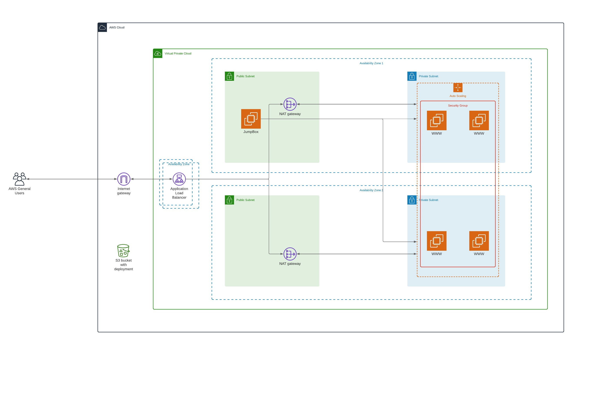

# Deploying with CloudFormation


## Project Specifications

> - You'll first develop a diagram that you can present as part of your portfolio and as a visual aid to understand the CloudFormation script.
> - The second part is to interpret the instructions as well as your own diagram and create a matching CloudFormation script.


## Summary

For this project I designed the infrastructure for deploying a highly available web app using AWS CloudFormation. Then I wrote the code based on the architecture design that deploys the infrastructure.

<div style="margin: 0 auto">
  
</div>

[CloudFormation Architecture Diagram](https://lucid.app/lucidchart/invitations/accept/abaef56a-8740-4f0c-95bc-9c0bc1be8cee)

The infrastructure includes the networking components (VPC, subnets, NAT gateways etc), and the server/security components (servers, security roles, auto scaling).

The CloudFormation configuration file responsible for creating the network components is the [network.yml](infrastructure/cloudformation/stacks/network.yml) file.

The CloudFormation configuration file responsible for creating the server components is the [servers.yml](infrastructure/cloudformation/stacks/servers.yml) file.

### Best Practices

Following best practices the necessary parameters for the network and server components are separated out into parameter files.

## Deployment Instructions

The source code for the web (dist.zip) are located in an S3 bucket.

To deploy the network stack run

```sh
infrastructure/scripts/create.sh udagram-network-infra infrastructure/cloudformation/stacks/network.yml infrastructure/cloudformation/parameters/network-parameters.json
```

To update the network stack run

```sh
infrastructure/scripts/update.sh udagram-network-infra infrastructure/cloudformation/stacks/network.yml infrastructure/cloudformation/parameters/network-parameters.json
```

To deploy the server stack run

```sh
infrastructure/scripts/create.sh udagram-server-infra infrastructure/cloudformation/stacks/servers.yml infrastructure/cloudformation/parameters/servers-parameters.json
```

To update the server stack run

```sh
infrastructure/scripts/update.sh udagram-server-infra infrastructure/cloudformation/stacks/servers.yml infrastructure/cloudformation/parameters/servers-parameters.json
```
